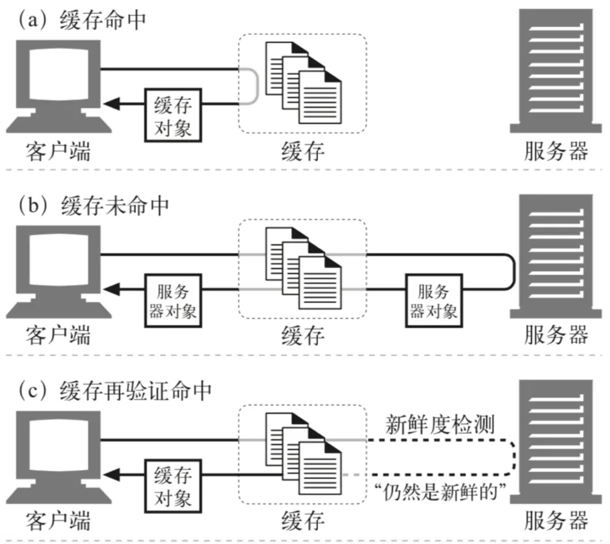

# 缓存

> 背景：了解缓存，优化流程，提升性能

- [缓存参考](https://juejin.im/post/5d9d539ee51d45780f0604fa?utm_source=gold_browser_extension)
- [前端缓存](https://zhuanlan.zhihu.com/p/44789005)

## why

**解决问题**

- 缓存减少了冗余的数据传输，节省了你的网络费用。
- 缓存缓解了网络瓶颈的问题。不需要更多的带宽就能够更快地加载页面。
- 缓存降低了对原始服务器的要求。服务器可以更快地响应，避免过载的出现。
- 缓存降低了距离时延，因为从较远的地方加载页面会更慢一些。 

