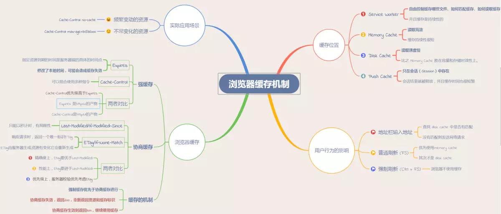

# 浏览器缓存

> 缓存可以说是性能优化中简单高效的一种优化方式了。一个优秀的缓存策略可以缩短网页请求资源的距离，减少延迟，并且由于缓存文件可以重复利用，还可以减少带宽，降低网络负荷。

对于一个数据请求来说，可以分为**发起网络请求、后端处理、浏览器响应**三个步骤。

[参考-深入理解浏览器的缓存机制](https://www.jianshu.com/p/54cc04190252)

## 缓存位置

从缓存位置上来说分为四种，并且各自有优先级，当依次查找缓存且都没有命中的时候，才会去请求网络。

- Service Worker: 运行在浏览器背后的独立线程, 传输协议必须为 HTTPS
- Memory Cache: 计算机分配的内存中的缓存，主要包含的是当前中页面中已经抓取到的资源, 一旦我们关闭 Tab 页面，内存中的缓存也就被释放了。
- Disk Cache：存储在硬盘中的缓存，读取速度慢点，但是什么都能存储到磁盘中，比之 Memory Cache 胜在容量和存储时效性上。
- Push Cache：推送缓存）是 HTTP/2 中的内容，当以上三种缓存都没有命中时，它才会被使用。它只在会话（Session）中存在，一旦会话结束就被释放，并且缓存时间也很短暂。

通常浏览器缓存策略分为两种：**强缓存和协商缓存，并且缓存策略都是通过设置 HTTP Header 来实现的**。

### 强缓存

> 强缓存可以通过设置两种 HTTP Header 实现：Expires 和 Cache-Control。 **两者同时存在的话，Cache-Control优先级高于Expires**

- expires: 缓存过期时间，用来指定资源到期的时间，是服务器端的具体的时间点。也就是说，Expires=max-age + 请求时间，需要和Last-modified结合使用
- Cache-Control: 在HTTP/1.1中，Cache-Control是最重要的规则，主要用于控制网页缓存。比如当Cache-Control:max-age=300时，则代表在这个请求正确返回时间（浏览器也会记录下来）的5分钟内再次加载资源，就会命中强缓存。

### 协商缓存

> 协商缓存就是强制缓存失效后，浏览器携带缓存标识向服务器发起请求，由服务器根据缓存标识决定是否使用缓存的过程.

协商缓存可以通过设置两种 HTTP Header 实现：Last-Modified 和 ETag 。

### 缓存机制

强制缓存优先于协商缓存进行，若强制缓存(Expires和Cache-Control)生效则直接使用缓存，若不生效则进行协商缓存(Last-Modified / If-Modified-Since和Etag / If-None-Match)，协商缓存由服务器决定是否使用缓存，若协商缓存失效，那么代表该请求的缓存失效，返回200，重新返回资源和缓存标识，再存入浏览器缓存中；生效则返回304，继续使用缓存。

